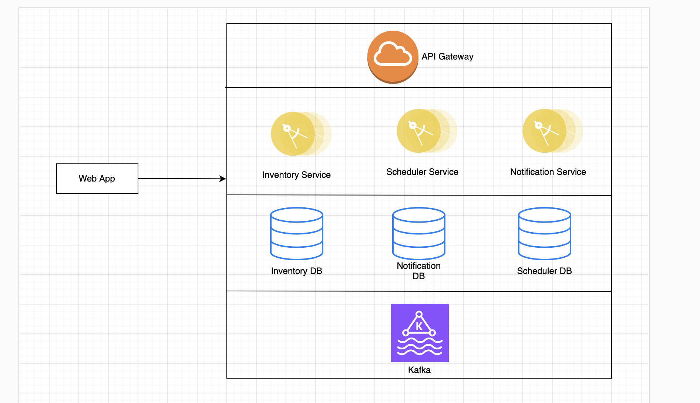

## Problem Statement: Create an animal vaccination app which will show the live stock of vaccination availability region wide. 

# Animal Vaccination App

## Overview

The **Animal Vaccination App** is a web-based solution that helps farmers to view available vaccination schedules while providing real-time information on the availability of vaccines region-wide. The system allows farmers to schedule vaccinations, view upcoming schedules, and check available stock for their region. Additionally, Admin can manage vaccine stocks and maintain accurate records of vaccinations.

## Features

### Farmer Features:
- **Authentication & Authorization**: Secure login for farmers to manage livestock vaccination records.
- **Vaccine Availability**: Real-time availability of vaccines in the farmer's region.
- **Vaccination Scheduling**: Farmers can schedule vaccinations for their animals based on the availability of vaccines.
- **Vaccination History**: Records of all past vaccinations, including date, type of vaccine, dosage, and vet details.
- **Notifications**: Reminders for upcoming vaccinations via SMS or notification on login.

### Admin Features:
- **Vaccine Inventory Management**: Admins can update and manage regional vaccine stocks in real time.
- **Vaccination Reports**: View and manage vaccination schedules across regions.
- **Stock Alerts**: Notifications of low vaccine stock levels.

## System Design

### Core Components
1. **Frontend**: 
   - A web app with separate interfaces for farmers and admin users.
   - Farmers can view livestock vaccination schedules, check vaccine stock, and can opt for vaccination on the given date.
   - Admins can manage vaccine stocks, view regional schedules, and generate reports.

2. **Backend**:
   - **Authentication Service**: Login for different user roles (Farmer and Admin).
   - **Vaccination Scheduler Service**: Manages the scheduling of vaccinations and ensures stock availability.
   - **Inventory Service**: Real-time updates on vaccine stock levels across regions.
   - **Notification Service**: Sends reminders and alerts for scheduled vaccinations or stock shortages.

3. **Database**:
   - **Relational DB (MySQL)**: Stores data for farmers, livestock, vaccines, and vaccination history.
   - **NoSQL DB (MongoDB)**: Stores unstructured data such as logs, notifications, and events.

4. **Notifications**:
   - **SMS/ In App Notifications**: Farmers receive reminders via channel like SMS or in app for upcoming vaccinations.

### High-Level Architecture

## Key Design Considerations

- **Scalability**:
  - The system is designed with a microservices architecture to scale individual services independently.
  - Load balancers to handle the request.
  
- **Reliability**:
  - Databases are replicated for high availability.
  - A message queue (Kafka) ensures critical notifications are delivered even in the event of downtime.

- **Security**:
  - Data is encrypted both in transit and at rest using SSL/TLS and database encryption.
  - Role-based access control (RBAC) ensures that users access only the data they are permitted to see.
    
---

## Database Schema for Vaccination App

Tables for the **Animal Vaccination App**,  designed using MySQL. It includes tables for managing farmers, animals, vaccines, vaccination schedules and inventory

## Tables

### 1. `farmers` Table
The `farmers` table stores information about the farmers using the system.

| Column Name      | Data Type      | Constraints                             | Description                           |
|------------------|----------------|-----------------------------------------|---------------------------------------|
| `farmer_id`      | INT            | PRIMARY KEY, AUTO_INCREMENT             | Unique identifier for the farmer      |
| `name`           | VARCHAR(255)   | NOT NULL                                | Farmer's full name                    |
| `email`          | VARCHAR(255)   | UNIQUE, NOT NULL                        | Farmer's email                        |
| `phone_number`   | VARCHAR(20)    | NOT NULL                                | Farmer's phone number                 |
| `region_id`      | INT            | FOREIGN KEY (`region_id`) REFERENCES `regions`(`region_id`) ON DELETE CASCADE | Region where the farmer resides       |
| `created_at`     | TIMESTAMP      | DEFAULT CURRENT_TIMESTAMP               | Date of registration                  |

### 2. `animals` Table
The `animals` table stores details about the animals owned by farmers.

| Column Name      | Data Type      | Constraints                             | Description                              |
|------------------|----------------|-----------------------------------------|------------------------------------------|
| `animal_id`      | INT            | PRIMARY KEY, AUTO_INCREMENT             | Unique identifier for the animal         |
| `farmer_id`      | INT            | FOREIGN KEY (`farmer_id`) REFERENCES `farmers`(`farmer_id`) ON DELETE CASCADE | Farmer who owns the animal               |
| `species`        | VARCHAR(100)   | NOT NULL                                | Species of the animal (e.g., cow, sheep) |
| `breed`          | VARCHAR(100)   | NOT NULL                                | Breed of the animal                      |
| `age`            | INT            | NOT NULL                                | Age of the animal in years               |
| `health_status`  | VARCHAR(255)   | NULL                                    | Current health status                    |
| `created_at`     | TIMESTAMP      | DEFAULT CURRENT_TIMESTAMP               | Date of record creation                  |

### 3. `vaccines` Table
The `vaccines` table stores the information about the available vaccines.

| Column Name        | Data Type      | Constraints                             | Description                              |
|--------------------|----------------|-----------------------------------------|------------------------------------------|
| `vaccine_id`       | INT            | PRIMARY KEY, AUTO_INCREMENT             | Unique identifier for the vaccine        |
| `vaccine_name`     | VARCHAR(255)   | NOT NULL                                | Name of the vaccine                      |
| `description`      | TEXT           | NULL                                    | Description of the vaccine               |
| `manufacturer`     | VARCHAR(255)   | NOT NULL                                | Manufacturer of the vaccine              |
| `dose`             | DECIMAL(5, 2)  | NOT NULL                                | Standard dosage for the vaccine (in ml)  |
| `age_group`        | VARCHAR(50)    | NOT NULL                                | Applicable age group for the vaccine     |
| `validity_period`  | INT            | NOT NULL                                | Duration in months for which the vaccine is effective |

### 4. `vaccination_records` Table
The `vaccination_records` table stores a record of vaccinations that have been administered to animals.

| Column Name          | Data Type      | Constraints                             | Description                              |
|----------------------|----------------|-----------------------------------------|------------------------------------------|
| `vaccination_id`     | INT            | PRIMARY KEY, AUTO_INCREMENT             | Unique identifier for the vaccination event |
| `animal_id`          | INT            | FOREIGN KEY (`animal_id`) REFERENCES `animals`(`animal_id`) ON DELETE CASCADE | Animal receiving the vaccination         |
| `vaccine_id`         | INT            | FOREIGN KEY (`vaccine_id`) REFERENCES `vaccines`(`vaccine_id`) ON DELETE CASCADE | Vaccine administered to the animal       |
| `administered_by`    | VARCHAR(255)   | NOT NULL                                | Name of the veterinarian or person who administered the vaccine |
| `date_administered`  | DATE           | NOT NULL                                | Date when the vaccine was administered   |
| `dose_administered`  | DECIMAL(5, 2)  | NOT NULL                                | Actual dose administered (in ml)         |
| `next_due_date`      | DATE           | NULL                                    | Date when the next vaccination is due    |

### 5. `regions` Table
The `regions` table stores information about different regions where farmers are located.

| Column Name      | Data Type      | Constraints                             | Description                              |
|------------------|----------------|-----------------------------------------|------------------------------------------|
| `region_id`      | INT            | PRIMARY KEY, AUTO_INCREMENT             | Unique identifier for the region         |
| `region_name`    | VARCHAR(255)   | NOT NULL                                | Name of the region                       |
| `pincode`        | VARCHAR(6)     | NOT NULL                                | PinCode of the region                    |
| `created_at`     | TIMESTAMP      | DEFAULT CURRENT_TIMESTAMP               | Date of record creation                  |

### 6. `vaccine_inventory` Table
The `vaccine_inventory` table tracks vaccine stock levels in different regions.

| Column Name      | Data Type      | Constraints                             | Description                              |
|------------------|----------------|-----------------------------------------|------------------------------------------|
| `inventory_id`   | INT            | PRIMARY KEY, AUTO_INCREMENT             | Unique identifier for the inventory record |
| `vaccine_id`     | INT            | FOREIGN KEY (`vaccine_id`) REFERENCES `vaccines`(`vaccine_id`) ON DELETE CASCADE | Vaccine in stock                         |
| `region_id`      | INT            | FOREIGN KEY (`region_id`) REFERENCES `regions`(`region_id`) ON DELETE CASCADE | Region where the vaccine is stored       |
| `stock_level`    | INT            | NOT NULL                                | Quantity of the vaccine in stock         |
| `last_updated`   | TIMESTAMP      | DEFAULT CURRENT_TIMESTAMP ON UPDATE CURRENT_TIMESTAMP | Date when the stock was last updated |

### 7. `vaccination_schedules` Table
The `vaccination_schedules` table stores the vaccination appointments and schedules.

| Column Name       | Data Type      | Constraints                             | Description                              |
|-------------------|----------------|-----------------------------------------|------------------------------------------|
| `schedule_id`     | INT            | PRIMARY KEY, AUTO_INCREMENT             | Unique identifier for the schedule       |
| `animal_id`       | INT            | FOREIGN KEY (`animal_id`) REFERENCES `animals`(`animal_id`) ON DELETE CASCADE | Animal to be vaccinated                  |
| `vaccine_id`      | INT            | FOREIGN KEY (`vaccine_id`) REFERENCES `vaccines`(`vaccine_id`) ON DELETE CASCADE | Vaccine to be administered               |
| `scheduled_date`  | DATE           | NOT NULL                                | Date when the vaccination is scheduled   |
| `status`          | VARCHAR(50)    | NOT NULL                                | Status of the schedule (e.g., Pending, Completed, Missed) |
| `created_at`      | TIMESTAMP      | DEFAULT CURRENT_TIMESTAMP               | Date of schedule creation                |

### 8. `notifications` Table
The `notifications` table stores reminders and notifications sent to farmers regarding upcoming vaccinations.

| Column Name       | Data Type      | Constraints                             | Description                              |
|-------------------|----------------|-----------------------------------------|------------------------------------------|
| `notification_id` | INT            | PRIMARY KEY, AUTO_INCREMENT             | Unique identifier for the notification   |
| `farmer_id`       | INT            | FOREIGN KEY (`farmer_id`) REFERENCES `farmers`(`farmer_id`) ON DELETE CASCADE | Farmer receiving the notification        |
| `message`         | TEXT           | NOT NULL                                | Notification message sent to the farmer  |
| `sent_at`         | TIMESTAMP      | DEFAULT CURRENT_TIMESTAMP               | Date and time when the notification was sent |

---

## Relationships

- Each **farmer** can own multiple **animals** (`farmers` ↔ `animals`: one-to-many).
- Each **animal** can have multiple **vaccination records** (`animals` ↔ `vaccination_records`: one-to-many).
- Each **vaccination** is linked to a specific **vaccine** and **animal**.
- **Regions** are associated with **farmers** and **vaccine stock**.
- The **vaccine_inventory** table tracks stock levels by region for each vaccine.
- The **vaccination_schedules** table handles scheduling for vaccinations.